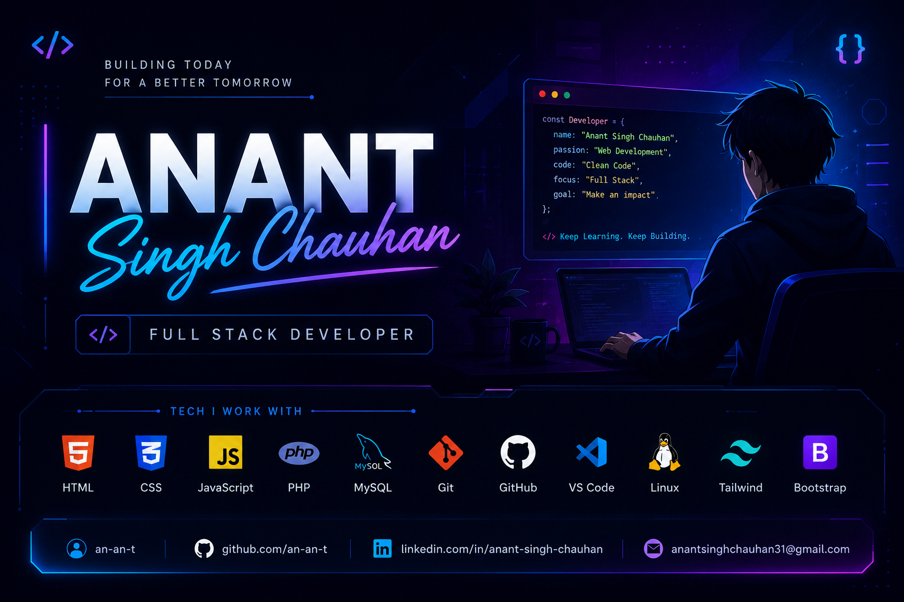

  

# Hey 👋 I'm Anant Singh Chauhan
### Full Stack Developer • Student • Building Modern Web Apps

 
## 👨‍💻 About Me

Hi, I'm **Anant Singh Chauhan**, a passionate **Full Stack Web Developer** and **BCA student** from India.

I enjoy building modern, responsive, and user-friendly web applications while continuously improving my development skills. I love turning ideas into real-world projects and learning new technologies that help me grow as a developer.

🚀 My goal is to become a skilled Full Stack Developer by building impactful projects, writing clean code, and continuously learning every day.

⚡ **Code • Build • Learn**

## 🚀 Current Focus

- 🌐 Building modern and responsive Full Stack web applications
- ⚡ Strengthening JavaScript fundamentals and ES6+
- 🗄️ Designing efficient databases and writing optimized SQL queries
- 🎨 Improving UI/UX with clean and responsive designs
- 📂 Building real-world projects to enhance my portfolio
- 💡 Practicing Data Structures & Problem Solving
- 🚀 Writing clean, scalable, and maintainable code
- 📚 Learning new technologies every day
- 🎯 Preparing for internships and software developer opportunities

## 🛠️ Tech Stack
<h2 align="center">💻 Languages</h2>

  

<h2 align="center">🛠️ Tools & Technologies</h2>

  

<h2>🚀 Developer Highlights</h2>

<table>
<tr>
<td>💻 <b>Full Stack Development</b></td>
<td>Building responsive and scalable web applications.</td>
</tr>

<tr>
<td>🌱 <b>Currently Learning</b></td>
<td>PHP, MySQL, Advanced JavaScript & Backend Development.</td>
</tr>

<tr>
<td>🎯 <b>Goal</b></td>
<td>Become a professional Full Stack Developer and contribute to open source.</td>
</tr>

<tr>
<td>⚡ <b>Interests</b></td>
<td>Web Development, UI/UX, Problem Solving & Clean Code.</td>
</tr>
</table>

<h2 align="center">📊 GitHub Analytics</h2>

  
  

  

<h2 align="center">🌐 Connect With Me</h2>

📧 <b>Email</b> 
anantsinghchauhan.official@gmail.com

 

💼 <b>LinkedIn</b> 
https://www.linkedin.com/in/anant-singh-65152b329?

 

🐙 <b>GitHub</b> 
https://github.com/an-an-t

---

<h2 align="center">💭 Philosophy</h2>

<i>"Code isn't just about writing programs; it's about turning ideas into reality."</i>

✨ Thanks for visiting my profile! 
If you like my work, consider giving a ⭐ to my repositories.

